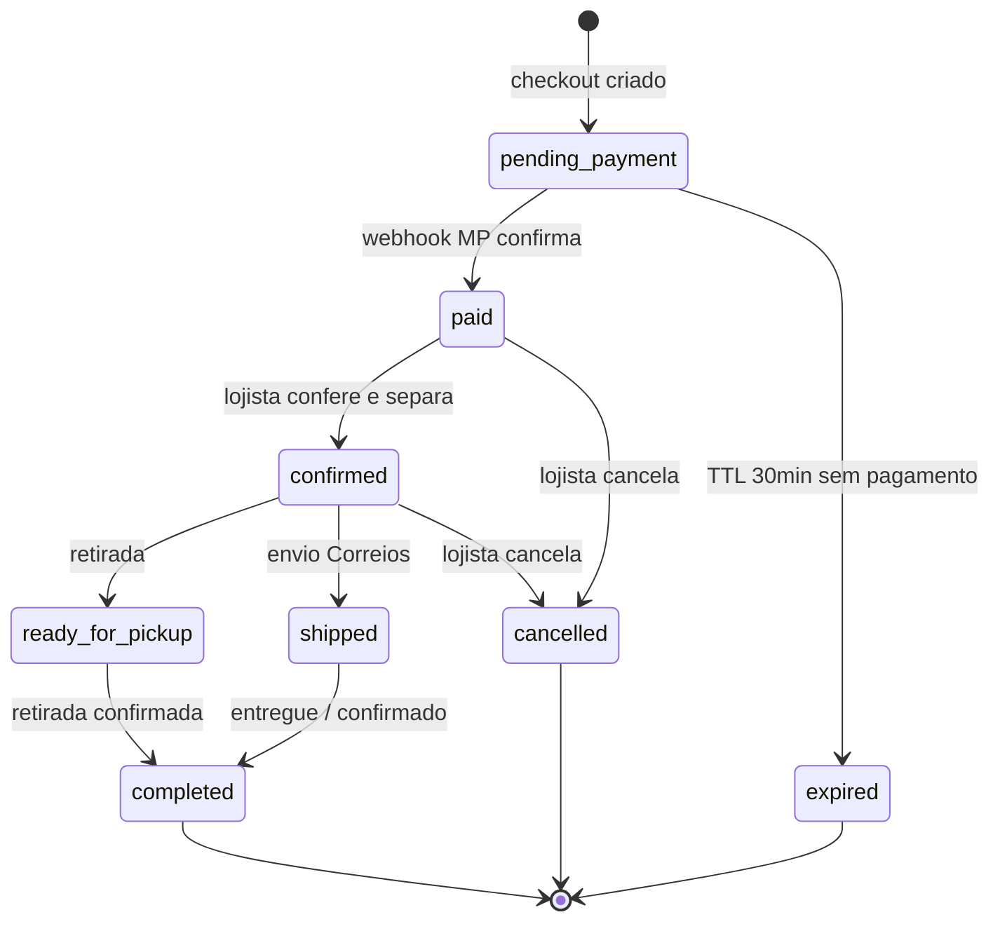
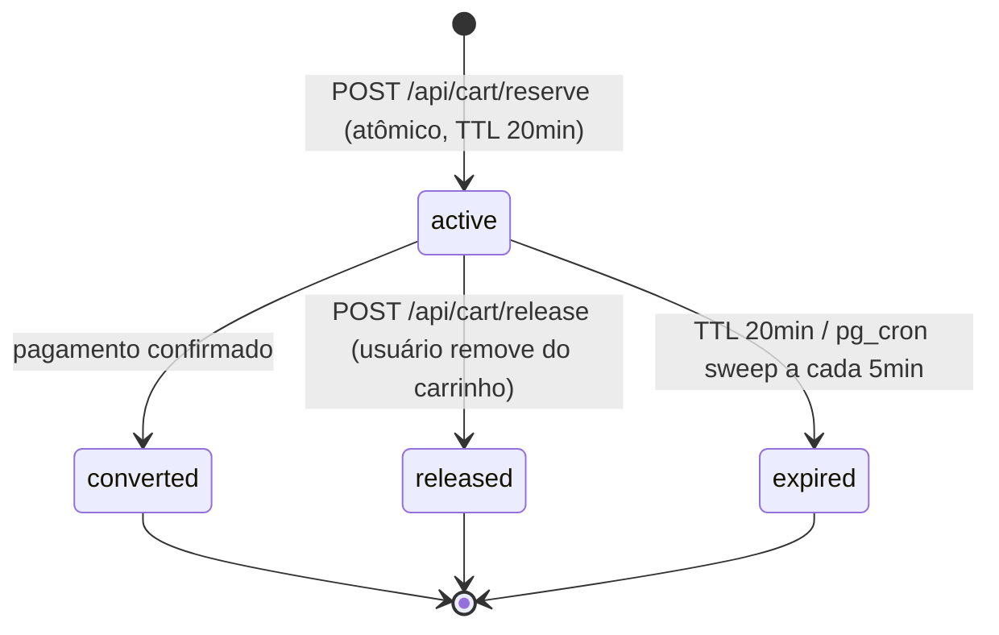

# 03 — Arquitetura

## Stack

| Layer | Tecnologia |
|---|---|
| Framework | Next.js 15 App Router, TypeScript strict |
| Styling | Tailwind CSS v4 + shadcn/ui |
| Forms | React Hook Form + Zod |
| Database / Auth / Storage | Supabase (PostgreSQL 17) |
| Realtime | Supabase Realtime (fulfillment queue) |
| Pagamentos | Mercado Pago Checkout Pro |
| Deploy | Vercel (root directory `./`) |
| Package manager | pnpm |

## Estrutura de pastas

```
/
├── app/
│   ├── (public)/           # layout público (header + footer + WhatsApp FAB)
│   │   ├── page.tsx        # Home
│   │   ├── catalogo/       # /catalogo?tamanho=&genero=&...
│   │   ├── produto/[slug]/ # PDP
│   │   ├── carrinho/       # /carrinho
│   │   ├── checkout/       # /checkout + /checkout/sucesso
│   │   ├── pedido/[codigo]/# /pedido/:codigo — página pública do pedido
│   │   └── desapegue/      # /desapegue — formulário multi-step
│   ├── admin/              # layout admin (sidebar + nav)
│   │   ├── login/
│   │   ├── page.tsx        # dashboard / fila de fulfillment
│   │   ├── produtos/       # CRUD + importação XLSX
│   │   ├── categorias/
│   │   ├── banners/
│   │   ├── pedidos/[id]/
│   │   └── configuracoes/
│   └── api/
│       ├── webhooks/
│       │   └── mercadopago/ # POST — valida assinatura, confirma pagamento
│       ├── payments/
│       │   └── sync/        # POST — consulta e sincroniza status de pagamento
│       ├── upload/          # POST — upload para Supabase Storage
│       ├── cart/
│       │   ├── reserve/     # POST — cria reserva atômica
│       │   └── release/     # POST — libera reserva
│       └── auth/
│           └── reset-request/
├── features/
│   ├── catalog/            # data fetching, filtros, mapeadores
│   ├── cart/               # store Zustand + reserva
│   ├── checkout/           # actions, schemas, componentes de seção
│   ├── orders/             # dados de pedido público + status
│   ├── payments/           # create-preference, fetch-payment, apply-status
│   ├── admin/              # session, actions de CRUD, dashboard
│   └── intake/             # formulário de desapego
├── components/
│   ├── public/             # Header, Footer, WhatsAppFAB, LeadPopup
│   ├── admin/              # AdminShell, OrderQueue, ProductForm
│   └── shared/             # MediaThumb, AnimatedSection, StatusBadge
├── lib/
│   ├── supabase/           # browser.ts, server.ts, server-service.ts, upload.ts
│   ├── mercado-pago/       # config.ts, create-preference.ts, fetch-payment.ts
│   ├── viacep.ts
│   └── env.ts              # typed env vars via Zod
└── supabase/
    ├── migrations/
    └── seeds/
```

## Mapa de rotas públicas

| Rota | Descrição |
|---|---|
| `/` | Home: banners, categorias em destaque, últimas novidades |
| `/catalogo` | Grid de produtos com filtros (query params) |
| `/produto/[slug]` | PDP |
| `/carrinho` | Resumo do carrinho + timer de reserva |
| `/checkout` | Formulário de compra |
| `/checkout/sucesso` | Confirmação pós-MP antes do webhook |
| `/pedido/[codigo]` | Página pública de acompanhamento |
| `/desapegue` | Formulário de desapego multi-step |

## Fluxo de checkout + webhook

```
[Checkout form]
    │ POST /api/cart/reserve  ← tenta reserva atômica por item
    │ (falha se item indisponível ou já reservado)
    ↓
[Create MP preference]
    │ retorna init_point
    ↓
[Redirecionar para Mercado Pago]
    │ buyer paga
    ↓
[MP notifica POST /api/webhooks/mercadopago]
    │ valida X-Signature
    │ busca pagamento na API do MP
    │ UPDATE orders SET status = 'paid', payment_status = 'paid'
    │ UPDATE products SET status = 'sold'
    │ DELETE cart_reservations (ou marca como converted)
    │ Supabase Realtime notifica admin
    ↓
[Admin vê pedido na fila]
    │ clica "Conferir e separar"
    │ UPDATE orders SET status = 'confirmed'
    ↓
[Admin atualiza status: pronto / enviado]
    │ UPDATE orders SET status = 'ready_for_pickup' | 'shipped'
```

## Ciclo de vida do pedido



## Ciclo de vida da reserva de carrinho




## Fila de fulfillment (Realtime)

A página `/admin` abre um canal Supabase Realtime para `orders` com filtro
`status = 'paid'`. Quando um novo pedido pago chega:

1. Badge numérico no `<title>` da aba muda.
2. Badge no nav item "Pedidos" incrementa.
3. Som de notificação (API Web Audio, sem dependência).
4. Card do pedido aparece no topo da fila.

O lojista clica em "Conferir e separar" para confirmar que os itens físicos existem
e estão sendo separados (ponto crítico de prevenção de over-sell presencial/online).

## Supabase Realtime channel

```ts
supabase
  .channel('fulfillment-queue')
  .on('postgres_changes', {
    event: 'INSERT',
    schema: 'public',
    table: 'orders',
    filter: "status=eq.paid",
  }, handleNewOrder)
  .subscribe()
```

## Auth strategy

- Admin: `supabase.auth.signInWithPassword` + cookie session via `@supabase/ssr`.
  `requireAdminSession()` em todas as server actions e rotas admin.
- Buyer: anônimo. Pedido vinculado a `customers.phone` / `customers.email`.
- Service role: usado apenas em server actions e rotas de API que precisam bypass RLS.
